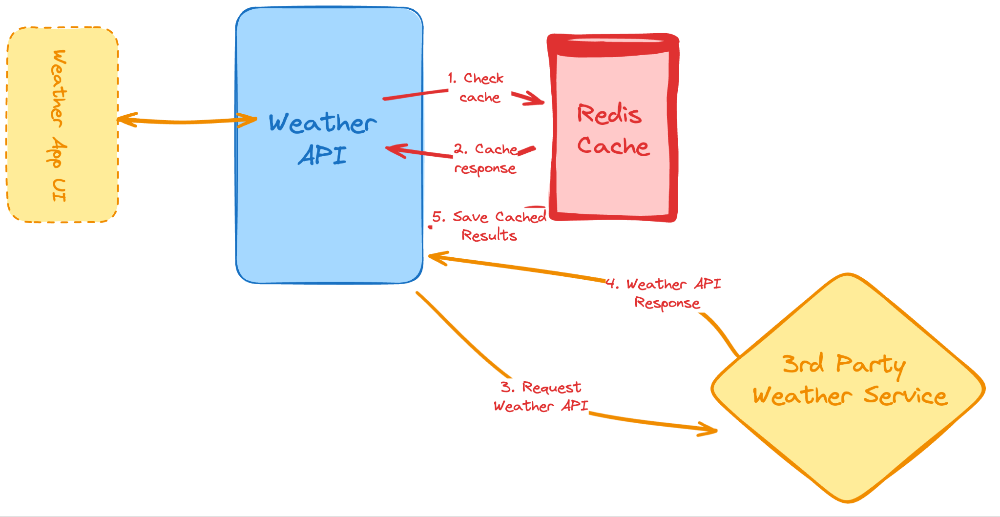

<div align="center">

# Weather API Wrapper Service

[Overview](#🎯-overview) •
[Features](#✨-features) •
[Getting Started](#🚀-getting-started) •
[Usage](#📘-usage) •
[API](#📚-api)

</div>

---

## 🎯 Overview

The Weather API Wrapper Service is a Flask-based web application that fetches and returns weather data from a third-party API (Visual Crossing). It uses Redis for caching responses to optimize performance and minimize API requests. The service also implements rate limiting to prevent abuse.

## ✨ Features

- **Weather Data Fetching**: Retrieve real-time weather data for any location.
- **Caching with Redis**: Cache responses in Redis to reduce redundant API calls.
- **Rate Limiting**: Limit the number of API requests per user to prevent abuse.
- **Error Handling**: Gracefully handle errors such as invalid city codes or third-party API downtime.
- **Environment Variables**: Store sensitive information like API keys and Redis credentials securely.

## 🚀 Getting Started

To get a local copy of the project up and running, follow these steps:

### Prerequisites

Ensure you have the following installed:

- Python 3.x
- Redis
- pip (Python package installer)
- Git

### Installation

1. Clone the repository:

   ```bash
   git clone https://github.com/hamza-140/weather-api-wrapper-service.git
   cd weather-api-wrapper-service
   ```

2. Create a virtual environment and activate it:

   ```bash
   python -m venv env
   source env/bin/activate  # On Windows use `env\Scripts\activate.bat`
   ```

3. Install the dependencies:

   ```bash
   pip install -r requirements.txt
   ```

4. Set up your environment variables in a `.env` file:

   ```bash
   echo "host=your-redis-host" > .env
   echo "port=your-redis-port" >> .env
   echo "password=your-redis-password" >> .env
   echo "api=your-visual-crossing-api-key" >> .env
   ```

5. Run the Flask development server:

   ```bash
   python main.py
   ```

## 📘 Usage

You can use the API to get weather information by making a GET request:

```bash
http://127.0.0.1:5000/weather/lahore
```

This will return the current weather for Lahore, utilizing cached data if available.

## 📚 API

This section documents the main endpoints of the API.

### `GET /weather/<location>`

Fetches the current weather for the specified location.

| Parameter  | Type   | Description                              |
| ---------- | ------ | ---------------------------------------- |
| `location` | String | The name of the city for weather details |

**Returns**: A JSON object containing the current weather information.

**Example**:

```bash
GET /weather/lahore
```

Response:

```json
{
  "status": "Using cached data from Redis",
  "temperature": "28.00 °C",
  "condition": "Clear",
  "wind_speed": "5 mph",
  "humidity": "65%",
  "location": "lahore"
}
```

## CC
https://roadmap.sh/projects/weather-api-wrapper-service